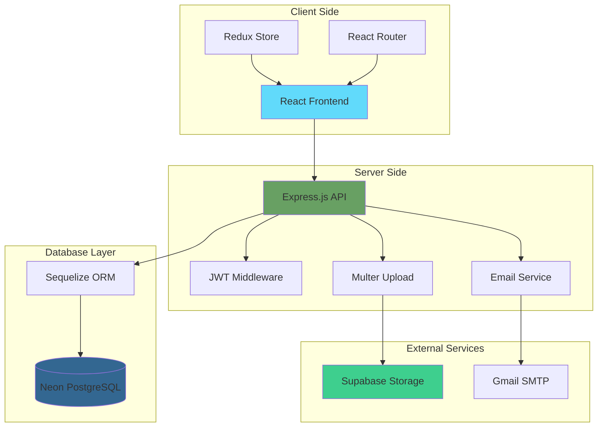
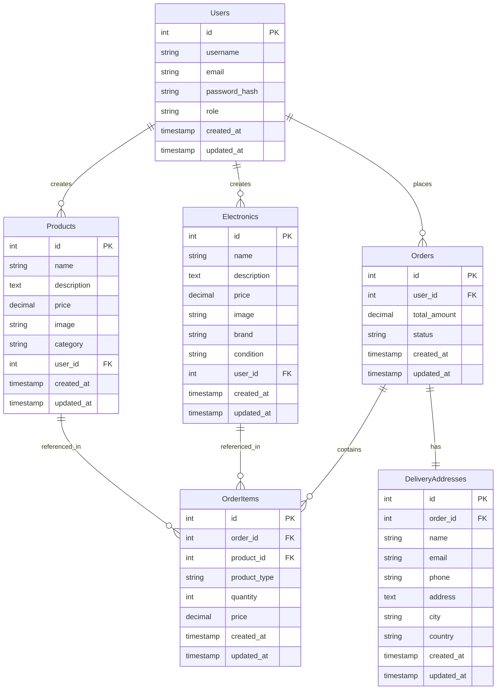
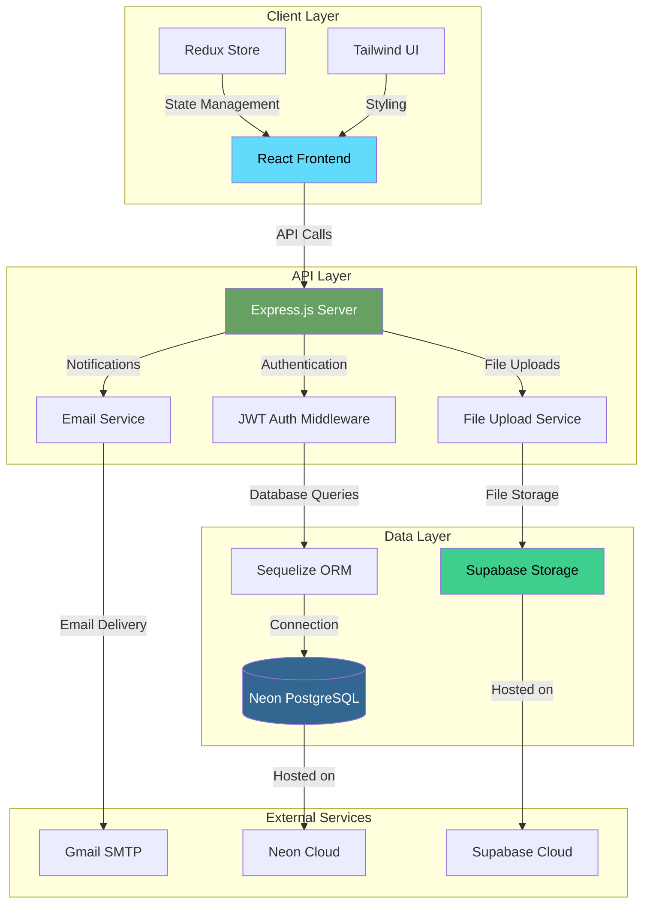

# 🌱 EcoFinds - Sustainable Second-Hand Marketplace


> **Empowering Sustainable Consumption through a Second-Hand Marketplace**

<!-- GitHub Badges -->
<div align="center">


](https://github.com/deekshithgowda85) | [](https://github.com/Manu77211) |

### 📧 **For questions or support, please open an issue:**

[](https://github.com/deekshithgowda85/EcoFinds-PERN/issues)
[](https://github.com/Manu77211/ecofinds/issues)

**Connect with the Team:**

- 🌟 **Star** the repository to show support
- 🐛 **Report issues** for bugs or improvements
- 💬 **Discussions** for questions and ideas
- 🚀 **Fork** to contribute to the project

</div>anu77211/ecofinds?style=for-the-badge)


</div>

---

## 📺 Demo Video

[](https://youtu.be/NpiCPbFmqrY)

**Click the image above to watch the full demo on YouTube!**

---

## 🚀 Vision & Mission

EcoFinds revolutionizes how people buy and sell pre-owned goods, fostering a culture of sustainability by extending product lifecycles, reducing waste, and providing a convenient alternative to buying new. Our mission is to build a user-friendly platform that connects buyers and sellers, making sustainable choices easy and accessible for everyone.

---

## 🛠️ Features

- **User Authentication:** Secure registration & login
- **Profile Management:** Edit username, profile, and dashboard
- **Product Listings:** Create, view, edit, and delete listings
- **Product Browsing:** Filter by category, search by keyword
- **Product Details:** View full product info
- **Cart & Checkout:** Add to cart, view summary, place orders
- **Order History:** View previous purchases
- **Admin Dashboard:** Manage users and products (for admins)

---

## 🧑‍💻 Tech Stack

| Layer              | Technology                                                            |
| ------------------ | --------------------------------------------------------------------- |
| **Frontend**       | React, Vite, Redux Toolkit, Tailwind CSS, React Router, Framer Motion |
| **Backend**        | Node.js, Express.js, Sequelize ORM                                    |
| **Database**       | PostgreSQL (Neon), Supabase Storage                                   |
| **Authentication** | JWT, bcryptjs, Express Session                                        |
| **File Upload**    | Multer, Supabase Storage API                                          |
| **Email**          | Nodemailer (Gmail SMTP)                                               |
| **Validation**     | Express Validator                                                     |
| **Dev Tools**      | Nodemon, Vite HMR, ESLint                                             |

---

## 🏗️ System Architecture

### Complete Application Flow



### Database Schema (Neon PostgreSQL)



### Supabase Storage Integration

```mermaid
graph LR
    A[Client Upload] --> B[Multer Middleware]
    B --> C[File Validation]
    C --> D[Supabase Storage API]
    D --> E[Storage Bucket: 'images']
    E --> F[Public URL Generated]
    F --> G[Database Record Updated]

    style D fill:#3ECF8E
    style E fill:#1F2937
```



---

## 📦 Project Structure

```
ecofinds/
├── 📁 frontend/                    # React application
│   ├── 📁 public/                  # Static assets
│   │   ├── bannner.jpg            # Hero banner image
│   │   ├── logo.png               # App logo
│   │   └── vite.svg               # Vite logo
│   ├── 📁 src/
│   │   ├── 📁 components/          # Reusable UI components
│   │   │   ├── CartItem.jsx       # Shopping cart item
│   │   │   ├── CartTab.jsx        # Cart sidebar
│   │   │   ├── Footer.jsx         # Page footer
│   │   │   ├── Header.jsx         # Page header
│   │   │   ├── Layout.jsx         # App layout wrapper
│   │   │   ├── MainBanner.jsx     # Hero section
│   │   │   ├── Navbar.jsx         # Navigation bar
│   │   │   └── ProductCart.jsx    # Product card
│   │   ├── 📁 pages/               # Page components
│   │   │   ├── CartSummary.jsx    # Cart overview page
│   │   │   ├── Checkout.jsx       # Payment & checkout
│   │   │   ├── Detail.jsx         # Product detail page
│   │   │   ├── Electronics.jsx    # Electronics catalog
│   │   │   ├── Home.jsx           # Landing page
│   │   │   ├── Login.jsx          # User authentication
│   │   │   ├── ProductPage.jsx    # Products catalog
│   │   │   └── Register.jsx       # User registration
│   │   ├── 📁 services/            # API integrations
│   │   │   └── api.js             # Axios HTTP client
│   │   ├── 📁 stores/              # Redux state management
│   │   │   └── Cart.js            # Shopping cart store
│   │   └── 📁 assets/              # Images & icons
│   ├── package.json               # Frontend dependencies
│   ├── tailwind.config.js         # Tailwind CSS config
│   └── vite.config.js             # Vite build config
├── 📁 backend/                     # Node.js API server
│   ├── 📁 config/                  # Configuration files
│   │   └── database.js            # DB connection setup
│   ├── 📁 middleware/              # Express middleware
│   │   ├── auth.js                # JWT authentication
│   │   └── upload.js              # File upload handler
│   ├── 📁 models/                  # Sequelize data models
│   │   ├── DeliveryAddress.js     # Delivery info model
│   │   ├── Electronics.js         # Electronics model
│   │   ├── Order.js               # Order model
│   │   ├── OrderItem.js           # Order items model
│   │   ├── Product.js             # Product model
│   │   └── User.js                # User model
│   ├── 📁 routes/                  # API route handlers
│   │   ├── auth.js                # Authentication routes
│   │   ├── orders.js              # Order management
│   │   ├── products.js            # Product CRUD
│   │   └── users.js               # User management
│   ├── 📁 utils/                   # Utility functions
│   │   ├── emailService.js        # Email notifications
│   │   └── supabaseClient.js      # Supabase integration
│   ├── .env.example               # Environment template
│   ├── index.js                   # Server entry point
│   └── package.json               # Backend dependencies
├── LICENSE                        # MIT License
└── README.md                      # Documentation
```

---

## ⚡ Quick Start

### 1. Clone the Repository

```bash
git clone https://github.com/Manu77211/ecofinds.git
cd ecofinds
```

### 2. Setup Environment Variables

Create a `.env` file in the backend folder using the template below:

```ini
# Server Configuration
PORT=5000
NODE_ENV=development

# Neon PostgreSQL Database (Primary Database)
DATABASE_URL=postgresql://<username>:<password>@<host>/<database>?sslmode=require

# JWT Authentication
JWT_SECRET=your_super_secure_jwt_secret_key_here

# Email Configuration (Gmail SMTP)
EMAIL_USER=your_email@gmail.com
EMAIL_PASSWORD=your_gmail_app_password
EMAIL_FROM=EcoFinds <your_email@gmail.com>

# Supabase Configuration (File Storage)
SUPABASE_URL=https://your-project.supabase.co
SUPABASE_ANON_KEY=your_supabase_anon_key
SUPABASE_SERVICE_ROLE_KEY=your_supabase_service_role_key
SUPABASE_STORAGE_BUCKET=images

# Frontend URL (CORS)
FRONTEND_URL=http://localhost:5173
```

#### 🔐 Environment Setup Guide:

1. **Neon Database**: Sign up at [neon.tech](https://neon.tech) and create a PostgreSQL database
2. **Supabase Storage**: Create account at [supabase.com](https://supabase.com) for file storage
3. **Gmail SMTP**: Generate app password in Gmail security settings
4. **JWT Secret**: Use a strong random string (32+ characters)

### 3. Install Dependencies

#### Frontend

```bash
cd frontend
npm install
```

#### Backend

```bash
cd ../backend
npm install
```

### 4. Initialize Database

```bash
cd backend
npm run db:init    # Initialize database tables
npm run db:sync    # Sync database schema
```

### 5. Start Development Servers

#### Backend (Terminal 1)

```bash
cd backend
npm run dev        # Starts on http://localhost:5000
```

#### Frontend (Terminal 2)

```bash
cd frontend
npm run dev        # Starts on http://localhost:5173
```

🎉 **Access the application at [http://localhost:5173](http://localhost:5173)**

---

## 🔧 Advanced Configuration

### Neon PostgreSQL Setup

1. Create account at [neon.tech](https://neon.tech)
2. Create new project and database
3. Copy connection string to `DATABASE_URL`
4. Database automatically scales and manages connections

### Supabase Storage Setup

1. Create project at [supabase.com](https://supabase.com)
2. Go to Storage → Create bucket named "images"
3. Set bucket to public access
4. Copy project URL and service role key

### Production Deployment

- **Frontend**: Deploy to Vercel, Netlify, or similar
- **Backend**: Deploy to Railway, Render, or Heroku
- **Database**: Neon automatically handles production scaling
- **Storage**: Supabase provides global CDN

---

## 🗂️ Architecture Diagrams

### High-Level System Overview



---

## 🤝 Contributing

We welcome contributions! Here's how you can help:

### Ways to Contribute

- 🐛 **Bug Reports**: Found a bug? Open an issue with reproduction steps
- 💡 **Feature Requests**: Have an idea? We'd love to hear it!
- 🔧 **Code Contributions**: Submit pull requests for bug fixes or features
- 📖 **Documentation**: Help improve our docs and guides
- 🎨 **Design**: UI/UX improvements and suggestions

### Development Workflow

1. Fork the repository
2. Create a feature branch (`git checkout -b feature/amazing-feature`)
3. Make your changes
4. Run tests and ensure code quality
5. Commit changes (`git commit -m 'Add amazing feature'`)
6. Push to branch (`git push origin feature/amazing-feature`)
7. Open a Pull Request

### Code Style

- Use ESLint configuration provided
- Follow React best practices
- Write meaningful commit messages
- Add comments for complex logic

---

## 📊 Project Stats


---

## 🛣️ Roadmap

- [ ] **Mobile App**: React Native mobile application
- [ ] **Payment Integration**: Stripe/PayPal payment processing
- [ ] **Real-time Chat**: Buyer-seller messaging system
- [ ] **Review System**: Product ratings and reviews
- [ ] **Advanced Search**: Elasticsearch integration
- [ ] **Social Features**: User profiles and following
- [ ] **Multi-language**: Internationalization support

---

## 🏆 Acknowledgments

- **Neon**: For providing serverless PostgreSQL database
- **Supabase**: For file storage and additional backend services
- **Tailwind CSS**: For the beautiful and responsive UI
- **React Community**: For the amazing ecosystem and tools

---

## 📄 License

This project is licensed under the **MIT License** - see the [LICENSE](LICENSE) file for details.

---

## 🌟 Show Your Support

If you found this project helpful, please consider:

- ⭐ **Starring** the repository
- 🍴 **Forking** for your own projects
- 📢 **Sharing** with the community
- 🐛 **Reporting** any issues you find

---

## � Contributors & Credits

### 🤝 **Project Contributors**

<div align="center">

| Avatar                                                                                                 | Contributor         | GitHub Profile                                                                                                                      |
| ------------------------------------------------------------------------------------------------------ | ------------------- | ----------------------------------------------------------------------------------------------------------------------------------- |
|         | **Manu77211**       | [](https://github.com/Manu77211)               |
|          | **devbharu**        | [](https://github.com/devbharu)                 |
|  | **Deekshith Gowda** | [](https://github.com/deekshithgowda85) |

</div>

### 🌟 **Special Thanks**

We extend our gratitude to:

- **🧠 AI Assistant**: For development guidance and code optimization
- **🎨 Design Inspiration**: Modern e-commerce platforms and sustainable marketplace concepts
- **📚 Learning Resources**: React, Node.js, and PostgreSQL communities
- **🔧 Tool Providers**: GitHub, Neon, Supabase, and all open-source libraries used

### 🎯 **Want to Contribute?**

We welcome new contributors! Here's how you can help:

1. **🐛 Bug Reports**: Found an issue? [Open an issue](https://github.com/deekshithgowda85/EcoFinds-PERN/issues)
2. **💡 Feature Requests**: Have ideas? We'd love to hear them!
3. **🔧 Code Contributions**: Fork, develop, and submit a pull request
4. **📖 Documentation**: Help improve our guides and documentation
5. **🎨 Design**: UI/UX improvements and suggestions

### 📊 **Contribution Stats**


---

## �💡 Contact & Support

<div align="center">

📧 For questions or support, please [open an issue](https://github.com/Manu77211/ecofinds/issues)
or
please [open an issue](https://github.com/deekshithgowda85/EcoFinds-PERN/issues)

</div>
